<div align=center>
 
</div>

<div align=center>
 
</div>

<!-- waka-box start -->
#### <a href="https://gist.github.com/ddee6660ea4819d749c4393b4cc8e382" target="_blank">📊 Weekly development breakdown</a>
```text
Go         🕓 11h18m █████████████████████▌░░░░░ 79.8%
YAML       🕓 48m    █▌░░░░░░░░░░░░░░░░░░░░░░░░░  5.7%
Vue.js     🕓 42m    █▎░░░░░░░░░░░░░░░░░░░░░░░░░  5.0%
TypeScript 🕓 29m    ▉░░░░░░░░░░░░░░░░░░░░░░░░░░  3.5%
Python     🕓 23m    ▋░░░░░░░░░░░░░░░░░░░░░░░░░░  2.7%
```
<!-- Powered by https://github.com/YouEclipse/waka-box-go . -->
<!-- waka-box end -->

<div align=center>
 <kbd> </kbd>
</div>
