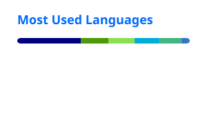

<div align=center>
 
</div>

<div align=center>
 
</div>

<!-- waka-box start -->
#### <a href="https://gist.github.com/ddee6660ea4819d749c4393b4cc8e382" target="_blank">📊 Weekly development breakdown</a>
```text
Lua        🕓 11h57m ███████████░░░░░░░░░░░░░░░░ 40.9%
TypeScript 🕓 3h53m  ███▌░░░░░░░░░░░░░░░░░░░░░░░ 13.3%
Vue        🕓 3h34m  ███▎░░░░░░░░░░░░░░░░░░░░░░░ 12.2%
JSON       🕓 2h13m  ██░░░░░░░░░░░░░░░░░░░░░░░░░  7.6%
TOML       🕓 1h53m  █▋░░░░░░░░░░░░░░░░░░░░░░░░░  6.5%
```
<!-- Powered by https://github.com/YouEclipse/waka-box-go . -->
<!-- waka-box end -->

<div align=center>
 <kbd> </kbd>
</div>
